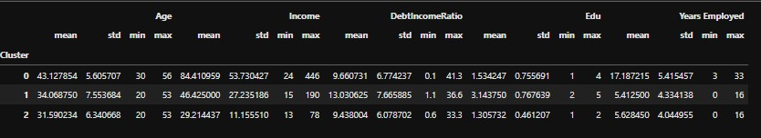
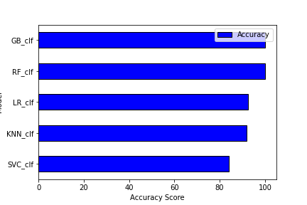
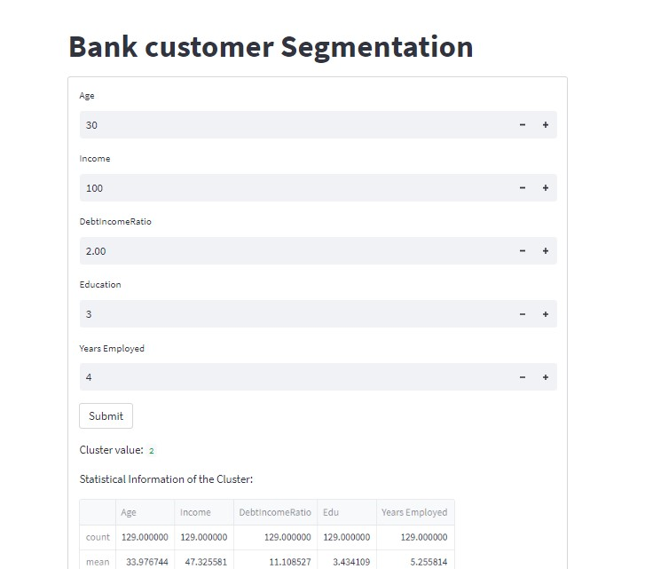

# Market Segmentation End to End Machine Learning with deployment Project

## Bank customer Segmenation for effective design of marketing strategies.

## Introduction
Customer segmentation is one of those important aspects that a business has to carefully consider before formulating products or services to it's customer base. Therefore pitching the right message to the right customer and at the right time has been the objective for all banks.Banks look at customer segmentation to gain insight, on how to decide on specific offers, improve customer service, and understand customer behaviour & more. The success or failure of a marketing campaign depends on how customers are segmented. Based on the customer segmentation, banks unleash product recommendations like saving plans, loans, wealth management, etc. on target customer groups.

##  Problem statement 
__How can we segment our customer base to improve cross-selling opportunities?__

<h3>Objective</h3> 
To segment and analysis bank customers so as to understand the kind of clients a bank has which can then be used in developing profitable products that can generate more revenue to the bank. 
 
<h4>Workflow</h4>
From the historical data, we will first train a machine learning clustering  model on customer profile variables to come up with target groups also known as clusters, there after, we will then train a classification model that ca predict which cluster a customer belongs to so as to tailor specific products to the client depending on the charactistics of the cluster.

## Skilled demonstrated.
- Python was used for coding the project as well as some data science algorithms
- I used jupyter notebooks as the main IDE for coding
- I used Visual Studio to develop and deploy the streamlit application

## Data sourcing
I just wanted to get my hands dirty with customer segmentation, so i went to kaggle.com and and got my hands on to this  <a href="https://www.kaggle.com/datasets/sidharth178/customer-segmentation">Dataset</a> so as to practice my skills. 
 The sample Dataset summarizes the usage behavior of about nearly 1000 active credit card holders during the last 6 months. The file is at a customer level with 10 behavioral variables.
 These include:'Customer Id', 'Age', 'Edu', 'Years Employed', 'Income', 'Card Debt','Other Debt', 'Defaulted', 'DebtIncomeRatio'

## Data tranformation and cleaning.
1.  I had to first dropped the 'unnamed 0' column since it was not meaningful for our project.
3.  There was some missing data in the defaulted variable, so i filled it in with the median for that column.

## Data Analysis and Visualization
Graph showing distribution of individual numerical variables
### key takes ways from the plot above
- The average age of clients is about 35 years with the age distribution being fairly skewed to the right
- Income and Card Debt are highly skewed to the right
- Debt income ratio and years employed have distributions that are skewed to the right.
- The highest number of clients have education in category 1.0

Graph showing Generated Clusters
### Cluster building
To perform clustering, we had to reprocess the data using principle component analysis algorithm to produce two principle componets as our dimensions to be used in the clustering. Further anlysis was performed to find the ideal number of clusters to be used in our data.
We considered the ideal number of clusters to be used as 3 that can be seen in the graph above.

Graph showing cluster analysis with data
Having performed some statistics on the generated clusters, we can draw the following conclusions
1. Cluster 1 has the highest average income of about 13k and average age of 46 years.This can be considerd as a high value target cluster for banking products such as loans and savings.
2. Cluster 2 has the least average income of about 9.4k and has the least average age of 29 years. This can be a target cluster for bank products such as mortgage and credit card
3. Cluster 0 has a moderate average income of about 9.7k and has the higest average age of 84 years. This can be a target cluster for bank products such as pension

## Final Model buiding and Evaluation
Model performance graph

A range of models were trained on the data and their performance assessed as seen in the a bar graph above.
The gradient boosting classifier and the Random forest model were the best performing classifer were the best performing  models.Further analysis was performed to know which of them was the better model and the Random forest emerged as slightly better than the grandient boosting model using comparing the performance of thier classification reports and confusion matrix. 
The best performing model was saved for saved for use in the streamlit application

## Model Deployment
Model performance graph

## Conclussions and Recommendations
### Conclusion

1. We can see that just like in 2016, the best selling product is still the savings product and therefore more emphasis in form of marketing should be put in selling this product to increase on the product uptake.
2. Unlike in 2016 where the least consumed product was mortgage, 2017 prediction results show that pension will be the least consumed product.
3. From the Prediction results, we also see that mortgage becomes the next consumed product after savings. 

### Final Remarks
Given more time, Since the constraint given was to contact the customers to sell them only one product and you can not select all of them, We may need to explore the contact channel and their effectiveness to be able to select the best channel to use according to their profitability, and also select which product will be sold to a given customer.

